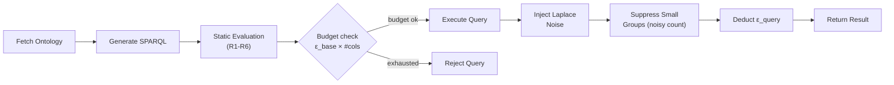

# Differential Privacy Integration Plan

## 1. Background & Problem Statement

The service currently protects data via **static query evaluation** (k-anonymity rules R1–R4 in `query_evaluation_service.py`). This prevents obviously dangerous queries but does **not** protect against an adversary who asks many carefully crafted *allowed* queries and combines the answers to re-identify individuals.

**Differential privacy (DP)** closes this gap by:
1. **Adding calibrated noise** to every query result, making it impossible to determine with certainty whether any individual's data was included.
2. **Tracking a privacy budget (ε)** that limits how many queries a user can ask before the cumulative information leakage exceeds an acceptable threshold.

### Scope (Current Phase)

| In scope | Deferred |
|---|---|
| Numeric and date attributes (cardinal scale) | Location values, ordinal scale |
| Single global in-memory session | Per-user session management, persistent budget storage |
| Laplace noise on `COUNT`, `SUM`, `AVG` | `MIN`/`MAX` (blocked by Rule R5) |
| Dynamic ε calculation per aggregate column | Query result caching |

### References for Further Reading

1. **Dwork, C. & Roth, A. (2014).** *The Algorithmic Foundations of Differential Privacy.* Foundations and Trends in Theoretical Computer Science, 9(3–4), 211–407. — The comprehensive textbook on DP theory. [PDF](https://www.cis.upenn.edu/~aaroth/Papers/privacybook.pdf)
2. **Dwork, C. (2006).** *Differential Privacy.* ICALP 2006. — The original paper introducing ε-differential privacy and the Laplace mechanism. [DOI](https://doi.org/10.1007/11787006_1)
3. **Near, J. & Abuah, C. (2021).** *Programming Differential Privacy.* — A practical, code-oriented introduction with Python examples. [Book site](https://programming-dp.com/)

---

## 2. Core DP Mechanisms

### 2.1 The Laplace Mechanism (Noise / "Salt")

For a numeric aggregate query `f(D)`, the DP answer is:

```
f(D) + Lap(Δf / ε_column)
```

| Symbol | Meaning |
|---|---|
| `Δf` | **Global sensitivity** – max change in `f` when one record is added/removed |
| `ε_column` | **Per-column privacy cost** – budget allocated to this specific aggregate column |
| `Lap(b)` | Random draw from Laplace distribution with scale `b` |

**Global sensitivity by aggregate:**

| Aggregate | `Δf` | Notes |
|---|---|---|
| `COUNT` | 1 | Always 1 |
| `SUM(x)` | `max(x) − min(x)` | Bounds from ontology overlay (mandatory) |
| `AVG(x)` | Uses **clipped-mean mechanism** (see §2.4) | Does not depend on dataset size `n` |
| `MIN / MAX` | Unbounded | **Blocked by Rule R5** |

### 2.2 Privacy Budget (ε)

- Session starts with `ε_total` (from env var).
- Each query consumes `ε_query = ε_base × num_aggregate_columns` (see §2.3).
- **Sequential composition**: total privacy loss = `Σ εᵢ`.
- When `ε_spent ≥ ε_total`, further queries are **refused**.

### 2.3 Dynamic ε Calculation

A flat `ε_per_query` regardless of query complexity under-accounts for multi-aggregate queries.

**Approach:** Each aggregate column in the SELECT clause consumes `ε_base` (from env var). The total budget cost of a query is:

```
ε_query = ε_base × number_of_aggregate_columns
```

This correctly accounts for sequential composition across columns within a single query. Before executing, the budget service checks whether `ε_remaining ≥ ε_query`.

### 2.4 Clipped-Mean Mechanism for AVG

Computing AVG sensitivity as `(max − min) / n` is problematic because `n` (the true record count) is itself a sensitive quantity. Instead, we use a **clipped-mean mechanism**:

1. **Clip** each value `x` to the ontology-defined bounds: `x_clipped = clamp(x, min, max)`.
2. Compute a noisy **SUM** of clipped values: `noisy_sum = SUM(x_clipped) + Lap((max − min) / ε_sum)`.
3. Compute a noisy **COUNT**: `noisy_count = COUNT + Lap(1 / ε_count)`.
4. Return `noisy_avg = noisy_sum / noisy_count`.

The ε budget for the AVG column is split: `ε_sum = ε_count = ε_base / 2`. This avoids dependence on the true dataset size and provides a formal DP guarantee.

### 2.5 Additional Measures

| Measure | Status |
|---|---|
| Static query evaluation (R1–R4) | ✅ Exists |
| **Rule R5**: Block `MIN`/`MAX` on semi-sensitive attrs | 🔲 To add |
| **Rule R6**: Reject aggregates on attrs without ontology bounds | 🔲 To add |
| Noise injection (Laplace) | 🔲 To add |
| Privacy budget tracking (dynamic ε) | 🔲 To add |
| Noisy small-group suppression (noise *then* suppress) | 🔲 To add |

---

## 3. Proposed Pipeline



> **Key change:** Noise is injected **before** small-group suppression. The suppression decision is based on the noisy count, so the act of suppressing does not leak additional information beyond what is already covered by the privacy budget.

---

## 4. Proposed Changes

### New: Privacy Module

#### [NEW] `privacy/__init__.py`

Exports `NoiseService` and `PrivacyBudgetService`.

#### [NEW] `privacy/noise_service.py`

- `NoiseService` class
- `add_noise(query_results, aggregate_info, attribute_bounds, epsilon_base)` → noisy results
  - Computes `Δf` per aggregate column using bounds from the ontology overlay
  - For `COUNT`: `Δf = 1`, adds `Lap(1 / ε_base)`
  - For `SUM`: `Δf = max − min`, adds `Lap(Δf / ε_base)`
  - For `AVG`: applies the **clipped-mean mechanism** (§2.4), splitting `ε_base` between the noisy SUM and noisy COUNT components
  - Handles date values by converting to numeric (epoch), adding noise, converting back
- `suppress_small_groups(query_results, count_var, min_group_size)` → filtered results
  - Uses the **noisy count** (already added by `add_noise`) to decide suppression
  - Groups with noisy count `< min_group_size` are removed

#### [NEW] `privacy/privacy_budget_service.py`

- `PrivacyBudgetService` class with a single global in-memory budget
- `calculate_query_cost(num_aggregate_columns) → float` — returns `ε_base × num_aggregate_columns`
- `check_budget(epsilon_query) → bool`
- `deduct_budget(epsilon_query)`
- `get_remaining() → float`
- `reset()` — for testing / demo restarts
- Initialised from env vars `EPSILON_TOTAL` and `EPSILON_BASE`

---

### New: Privacy Config Model

#### [NEW] `models/privacy_config.py`

- `PrivacyConfig` dataclass: `epsilon_total`, `epsilon_base`, `min_group_size`
- Loaded from env vars with defaults (`ε_total=1.0`, `ε_base=0.1`, `min_group_size=5`)

---

### Modified: Ontology

#### [MODIFY] [fetch_ontology_service.py](file:///c:/Users/d50146/Desktop/oyd/talk-to-data-service/orchestrator/fetch_ontology_service.py)

- Read `min` and `max` from the ontology overlay (same section as sensitivity level)
- Populate new `Attribute.min_value` and `Attribute.max_value` fields

#### [MODIFY] [ontology.py](file:///c:/Users/d50146/Desktop/oyd/talk-to-data-service/models/ontology.py)

- Add `min_value: Optional[float]` and `max_value: Optional[float]` to `Attribute`

---

### Modified: Query Evaluation

#### [MODIFY] [query_evaluation_service.py](file:///c:/Users/d50146/Desktop/oyd/talk-to-data-service/query_evaluation/query_evaluation_service.py)

- **Rule R5**: Reject `MIN`/`MAX` aggregates (`Aggregate_Min`, `Aggregate_Max`) on semi-sensitive attributes (unbounded sensitivity makes useful DP noise impossible)
- **Rule R6**: Reject `COUNT`/`SUM`/`AVG` aggregates on semi-sensitive attributes that have **no `min_value`/`max_value`** defined in the ontology. Without bounds, `Δf` is undefined and noise cannot be calibrated. (`COUNT` is exempt from this rule since its sensitivity is always 1.)
- Extend return value to include **aggregate metadata**: for each projected variable, the aggregate function used and which attribute it operates on — needed by `NoiseService` to compute `Δf` and determine the number of aggregate columns for dynamic budget calculation
- **Block `Aggregate_Sample` and `Aggregate_GroupConcat`** on semi-sensitive attributes (they can leak individual values)

---

### Modified: Query Execution

#### [MODIFY] [query_execution_service.py](file:///c:/Users/d50146/Desktop/oyd/talk-to-data-service/query_execution/query_execution_service.py)

- **Preserve numeric types** in query results instead of converting all values to `str`
- Use `val.toPython()` from RDFLib to get native Python types (`int`, `float`, `datetime`, etc.)
- This ensures `NoiseService` receives actual numeric values that can have noise added directly

---

### Modified: Orchestrator & Server

#### [MODIFY] [orchestrator_service.py](file:///c:/Users/d50146/Desktop/oyd/talk-to-data-service/orchestrator/orchestrator_service.py)

- Wire in `PrivacyBudgetService` and `NoiseService`
- Flow: static eval → calculate `ε_query` from aggregate count → budget check → execute → **add noise → suppress small groups** → deduct budget → return
- Build `attribute_bounds` dict from ontology's `min_value`/`max_value`
- Return `remaining_budget` in the response

#### [MODIFY] [server.py](file:///c:/Users/d50146/Desktop/oyd/talk-to-data-service/server.py)

- Return `remaining_budget` in the JSON response
- Add `GET /api/privacy-budget` endpoint to query current budget status
- Add `POST /api/privacy-budget/reset` for demo restarts

---

### New: Environment Variables

#### [MODIFY] [.env.example](file:///c:/Users/d50146/Desktop/oyd/talk-to-data-service/.env.example)

Add:
```env
# Differential Privacy Configuration
EPSILON_TOTAL=1.0
EPSILON_BASE=0.1
MIN_GROUP_SIZE=5
```

#### [MODIFY] `.env`

Add the same variables with working defaults.

---

## 5. Verification Plan

### Automated Tests

- **`tests/test_noise_service.py`**:
  - Verify Laplace scale = `Δf/ε` for COUNT and SUM
  - Verify clipped-mean mechanism for AVG: noisy_sum and noisy_count are independently noised, result = noisy_sum / noisy_count
  - Verify noise is added to numeric results, deterministic seed produces reproducible output
  - Verify suppression uses noisy count, not true count
  - Edge cases: single row, all groups below threshold
- **`tests/test_privacy_budget_service.py`**:
  - Budget creation, dynamic cost calculation (`ε_base × num_columns`)
  - Deduction, exhaustion, rejection, reset
  - Multi-column query costs more than single-column
- **`tests/test_query_evaluation_r5_r6.py`**:
  - Rule R5 blocks `MIN`/`MAX` on semi-sensitive attributes
  - Rule R6 blocks `SUM`/`AVG` on semi-sensitive attributes without ontology bounds
  - `COUNT` is exempt from Rule R6
  - `Aggregate_Sample` and `Aggregate_GroupConcat` are blocked on semi-sensitive attributes
- **`tests/test_query_execution_types.py`**:
  - Verify numeric values come back as `int`/`float`, not strings
- **`tests/test_orchestrator_privacy.py`**: Full pipeline integration test

Run: `python -m pytest tests/ -v`

### Manual Verification

1. Start the server, send repeated queries — results should differ slightly each time (noise).
2. Send a query with multiple aggregates — verify the budget deduction is `ε_base × num_columns`.
3. After `≈ ε_total / (ε_base × avg_columns_per_query)` queries, the service should return a budget-exhausted error.
4. Call `/api/privacy-budget/reset` and verify queries work again.
5. Send a query with `SUM` or `AVG` on an attribute missing ontology bounds — verify it is rejected with a Rule R6 message.
